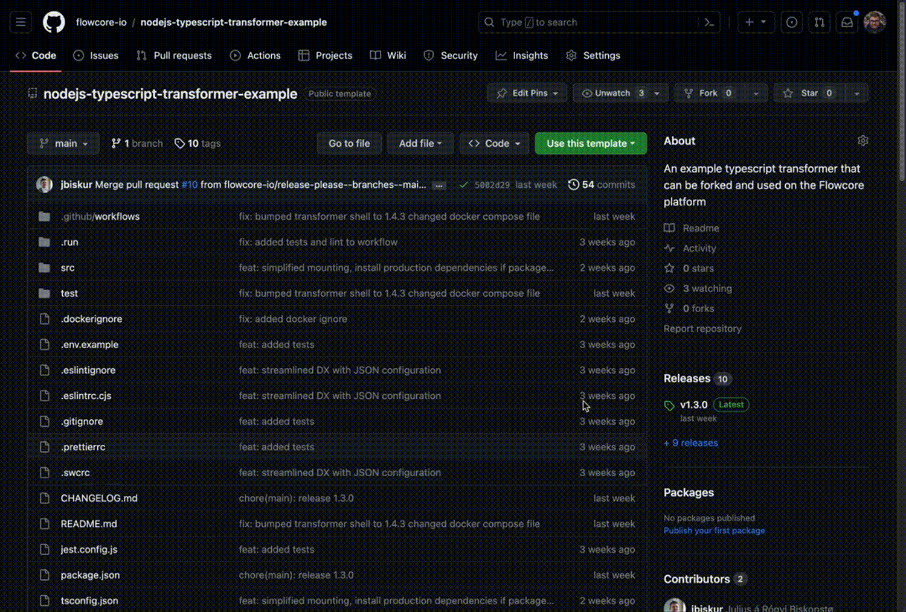

# NodeJS Typescript Transformer Example Repository

This repository contains a simple example of a NodeJS Typescript Transformer.

## Entrypoint

The `main.ts` file is the entrypoint for the transformer. It contains the following endpoints:

### GET /health

This endpoint is used by the transformer shell to check if the transformer is healthy.

### POST /transform

This endpoint is used by the transformer shell to transform data.

## 📝 Quick start

### 📑 Generate your own repository from this template


<br/>

## 🚀 Deployment

We try to simplify your development experience, by including a pipeline that will automatically test, build and push the
release artifact to the GitHub release. However, if you wish to modify the GitHub Action workflow, or use your own, you
are completely free to do so.

### 🔧 Preparing our pre-made Pipeline

Before you can utilise our pre-built pipeline, you need to authenticate yourself with it. This is done by:

1. generating a personal access token with the permission of creating artifacts.
2. adding a `new repository secret` to your `Settings > Secrets and variables > Actions`, with the name
   of `RELEASE_GITHUB_TOKEN`, and the value of your newly created personal token

You can follow our step-by-step video guide, if you are not accustomed to this process:

[Automating the release process for your Transformer with GitHub Actions](https://youtu.be/QveUgYLJWe8)

### 1️⃣.2️⃣.0️⃣ Release Artifact Versioning

We utilise [Conventional Commits](https://www.conventionalcommits.org/en/v1.0.0/#summary) to automatically manage the
versioning of your released artifacts. In short:

- prefixing your commits with `feat: ` will trigger a minor version (1.**2**.0)
- prefixing your commits with `fix: ` will trigger a patch version (1.0.**3**)

As an example: `feat: splitting email into username and domain`, or `fix: email now splits correctly by @ symbol`

If you need anything more granular, then you can refer to the link above.

### 🔄 Release Process

If using the correct [conventional commit syntax](#120-release-artifact-versioning), then the release process is as
follows:

Anything that gets pushed to the `main` branch, will trigger a pull request; that runs tests to validate the release.
Once the pull request has been merged the release will be published, together with the artifact.

## 💻 Development

We have **2 recommended methods** of working on your transformer.

1. [Develop it directly from GitHub](#option-1-develop-directly-in-github-simple)
2. [Run it locally]()

Your choice may vary depending on your development environment, preference and/or complexity.

### Option 1: Develop directly in GitHub (Simple)

> You can look at how you start the editor directly in your browser [here](https://github.com/github/dev).

Make your changes
and [push them to your repository](https://code.visualstudio.com/docs/sourcecontrol/intro-to-git#_staging-and-committing-code-changes).
**Bear in mind** that you need to use conventional commits to be able to release your transformer. You can read more
about
it under [Deployment](#-deployment).

### Option B: Develop locally (Advanced)

### 1. ⚙️ Installation️

> Prerequisites:
> - NodeJS
> - Docker
>
> And you must clone the project on to your machine

install dependencies:

```bash
yarn install && yarn build
```

run the transformer shell

```bash
docker-compose -f test/docker/docker-compose.yaml up -d
```

### 2. 💻 Development

To start developing with watch mode run:

```bash
yarn build:watch
```

In another terminal or tab, run:

```bash
yarn test:watch
```

to run the tests on the built transformer.

When changes are made any of the files the transformer will be reloaded and the tests will be run again.

> **Note**: The dist directory needs to be writable by the transformer shell.

## 🔎 Development Overview

### Change the transformer

To change the transformer, edit the `transform.entrypoint.ts` file. To add functionality on startup edit
the `start.entrypoint.ts` file. To add additional health checks edit the `health.entrypoint.ts` file.

### Change the input and output data

To change the validation of inputs and outputs edit the `test/expected.json` file. This file specify the event payloads
that are sent to the transformer and the expected output. The `:uuid:` and `:date:` values for the expected outcome
matches to any string.

### Further customization

Change the `test/app.spec.ts` file to add additional tests and more advanced validation. Further change the files in
the `src` directory to add more advanced logic.

## 🌕 Utilise your Transformer in Flowcore

<!-- todo: move this to a another part -->
To use this transformer in the [Flowcore](https://flowcore.io) platform, create a new adapter and point it to the github
release artifact.

The shell will then download the artifact, run it and for each data point post to the `transform` endpoint.

<!-- todo: add a video -->